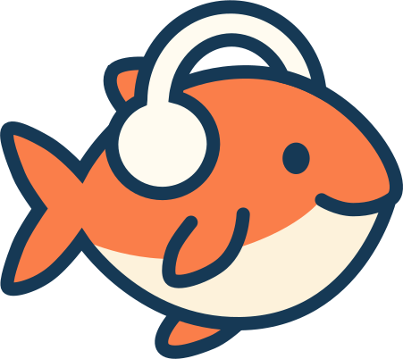

# Podfish

Podfish is a self-hostable podcast client. It lets you browse your favorite podcasts, play episodes, keep track of which episodes you've heard already, and more. It aims to be like Google Podcasts minus the discovery features.

<p align="center">

</p>

# Screenshots


# How to Run

Getting started is easy. Just run:
```
docker compose up
```

Common settings such as the environment (dev/prod), ports, keys, and more can be set in the `.env` file.

By default the app is accessible at: [http://localhost:8080/](http://localhost:8080/)

The API docs are accessible at: [http://localhost:8080/swagger/index.html](http://localhost:8080/swagger/index.html)

## Contributing

I'm currently not accepting pull requests as the app is still in its early stages. However I will welcome collaboration once the first major version is released :)
