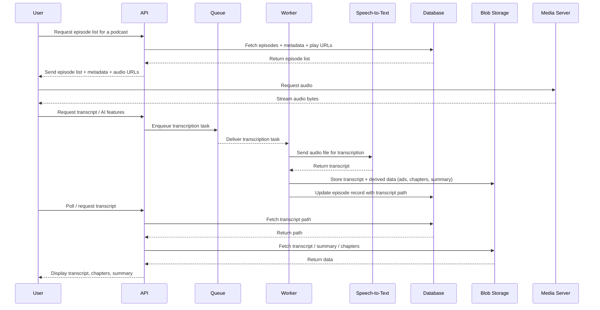

# Podcast Playback & AI Processing Flow

```mermaid
sequenceDiagram
    participant U as User
    participant A as API
    participant Q as Queue
    participant W as Worker
    participant STT as Speech-to-Text
    participant DB as Database
    participant FS as Blob Storage
    participant M as Media Server

    %% Episode list page
    U->>A: Request episode list for a podcast
    A->>DB: Fetch episodes + metadata + play URLs
    DB-->>A: Return episode list
    A-->>U: Send episode list + metadata + audio URLs

    %% User starts playing an episode
    U->>M: Request audio
    M-->>U: Stream audio bytes

    %% Transcription triggered
    U->>A: Request transcript / AI features
    A->>Q: Enqueue transcription task
    Q-->>W: Deliver transcription task

    W->>STT: Send audio file for transcription
    STT-->>W: Return transcript
    W->>FS: Store transcript + derived data (ads, chapters, summary)
    W->>DB: Update episode record with transcript path

    %% User fetches transcript
    U->>A: Poll / request transcript
    A->>DB: Fetch transcript path
    DB-->>A: Return path
    A->>FS: Fetch transcript / summary / chapters
    FS-->>A: Return data
    A-->>U: Display transcript, chapters, summary
```
